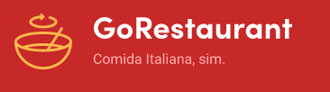
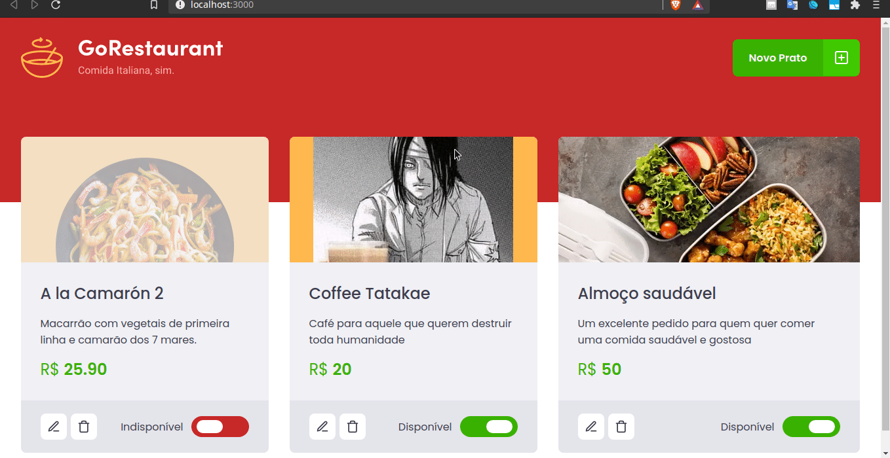

# Refatorando um projeto React ⚛

## Uma descrição sobre o desafio ✍️

Go Restaurant é uma aplicação que contém um crud de comidas onde usamos vários conceitos de programação do lado do front end, onde o desafio consistia em uma refatoração completa de uma aplicação que estava funcionando o formato de classes e Javascript para o formato de funções e Typescript

## Layout Preview 🚀
